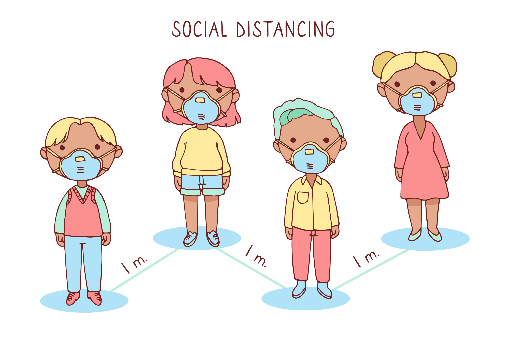

# Cov-Distance

An application to measure and control the distance between pedestrians.

## Technical specifications
- Python
- OpenCV
- Flask
- Google Cloud Vision  
- Google Cloud Videointelligence
- Google Cloud Storage

## Motivation

During the coronavirus outbreak, I participated in a Hackathon with three university colleagues in the Multimedia Systems subject. Our project involved implementing a solution that used Google Cloud technologies to measure the distance between pedestrians. The main goal of our application was to detect if people in an image were respecting the minimum security distance during a pandemic.

By utilizing the Google Cloud Platform, we were able to create an innovative solution that helped ensure people's safety during a pandemic. Our application aimed to provide a quick and efficient way of determining whether individuals were adhering to social distancing guidelines. 

## Description

In this project, Google Cloud Platform technologies are combined with Artificial Intelligence and Computer Vision to detect people, determine their location and calculate their distance.

The detection of pedestrians in the image was accomplished by obtaining frames from a video stored in Cloud Storage using OpenCV and then using Vision API, specifically `object_localization()`, to locate objects of type `Person`.

Finally, a Flask web application was implemented using Compute Engine to display the execution results

Once we have detected the position of each person in the frame, we must calculate the distances between each one of them. To do this, we use the Homography technique to create a mapping of the perpendicular arrangement of the street with which we can measure the distances in the image correctly.

Once the distances were calculated, it was only necessary to define the color to indicate the distances, so that a distance less than 1.5 meters will have a red alert color, a distance between 1.5 meters and 2 meters will be an orange precaution color, and a completely safe distance of 2m or more will be indicated with a green color.

## Results

YouTube video

